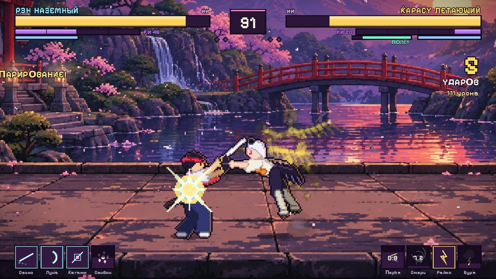
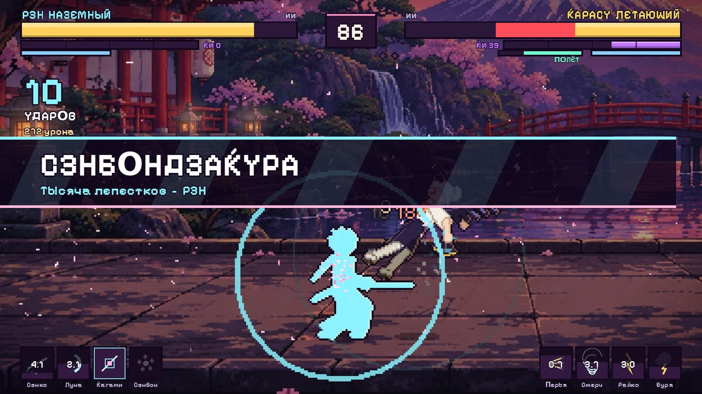

# Sakura Clash

2D-файтинг в пиксельном аниме-стиле на **Godot 4**. Вид сбоку, арена у храма под сакурой на закате, падающие лепестки, два бойца: наземный и летающий.



## Запуск

1. Установите **Godot 4.4 или новее**, стандартная версия (не .NET). Проверено на 4.7.
2. В менеджере проектов нажмите **Import** и выберите `sakura_clash/project.godot`.
3. Нажмите **F5** (Run Project).

Сцены почти целиком собираются в коде, в редакторе хранится только `scenes/main.tscn`. Отрисовка идёт через GL Compatibility, так что игра работает даже на слабых видеокартах.

## Режимы

| Режим | Что это |
|---|---|
| **Бой с ИИ** | Вы против компьютера, три уровня сложности |
| **Два игрока** | Локальный бой. P1: клавиатура и мышь, P2: стрелки и Numpad или геймпад |
| **Тренировка** | Манекен, бесконечные HP и Ки, режимы манекена на клавишах 1–4, хитбоксы на F1 |

Бой идёт до двух побед в раундах, раунд длится 99 секунд. В главном меню на фоне сражаются два ИИ.

## Управление (игрок 1)

| Действие | Клавиши |
|---|---|
| Ходьба | **A / D** |
| Вверх / вниз (полёт, присесть) | **W / S** |
| Прыжок, двойной прыжок, прыжок от стены | **Пробел** |
| **Рывок** | **Shift + WASD** или **двойное нажатие** направления (нажать, отпустить и быстро зажать снова) |
| Бег / ускорение | после рывка держите направление. Бег **не сбрасывается при смене направления** |
| Уклонение назад | **Shift** без направления |
| Высокий прыжок (наземный) | **Shift + W** |
| Лёгкий удар (цепочка до 4 ударов) | **ЛКМ** |
| Тяжёлый удар (держать = заряд) | **ПКМ** |
| Удар вверх / вниз | **W / S + удар** |
| Бросок (пробивает блок) | **ЛКМ + ПКМ** одновременно или **V** |
| Способности | **Q, E, R**, целятся **мышью** |
| Ультимейт | **F**, нужна полная шкала Ки |
| Блок / парирование | держать **C**, **Ctrl** или колесо мыши. Короткое нажатие прямо перед ударом даёт парирование |
| Пауза / управление | **Esc** |
| Полный экран | **F11** |

**Игрок 2 (клавиатура):** стрелки, NUM4 лёгкий удар, NUM5 тяжёлый, NUM6 блок, NUM8 прыжок, NUM0 рывок, NUM7/9/1 для Q/E/R, NUM3 ульта, NUM2 бросок.
**Геймпад:** стик или крестовина, A прыжок, X лёгкий, Y тяжёлый, B блок, RB рывок, LB/LT/RT для Q/E/R, R3 ульта, L3 бросок.

## Бойцы

### РЭН — странствующий ронин (наземный)
1100 HP. Катана, двойной прыжок, которым можно **допрыгнуть до потолка**, цепляние за стены и прыжок от стены, бег, один воздушный рывок за прыжок.

| | Способность |
|---|---|
| **Q** Сэнко | Мгновенный рывок-телепорт сквозь врага. Разрез «догоняет» с задержкой, на рывке есть неуязвимость |
| **E** Цукикагэ | Лунная волна: снаряд-полумесяц, наклон задаётся мышью |
| **R** Кагами | Стойка-контратака. Если в неё ударить, Рэн оказывается за спиной врага и подбрасывает его разрезом |
| **F** Сэнбондзакура | Ультимейт: рывок, затем шквал из 11 разрезов со всех сторон и финальный удар с взрывом лепестков |

### КАРАСУ — вороний тэнгу (летающий)
900 HP. Свободный полёт в 8 направлениях, рывки во все стороны, ускоренный полёт, веер, ветер и молнии.

| | Способность |
|---|---|
| **Q** Кадзэ-но-Ханэ | Веер из трёх перьев в сторону прицела |
| **E** Ороси | Смерч: медленно летит, затягивает врага и лепестки, бьёт много раз |
| **R** Райко | Громовой нырок в сторону прицела. При ударе о землю даёт ударную волну |
| **F** Буря Райдзина | Ультимейт: серия молний по позиции врага с предупреждением и огромный финальный разряд |

**Слабости летающего:** меньше здоровья. У полёта есть **выносливость**: она тратится на полёт, рывки и ускорение, при нуле боец падает и не может взлететь, пока не отдохнёт на земле. В воздухе летун получает **+10% урона** и отлетает на 15% дальше, а любое попадание сбивает его с полёта. Блок в воздухе тратит в 1.5 раза больше шкалы защиты. Удары-подбросы наземного бойца наносят летящему дополнительный урон.

## Боевая система

- **Цепочки:** ЛКМ ×4. Из лёгкого удара можно отменить в тяжёлый, из удара при попадании в способность (Q/E/R), из способности в ульту.
- **Направленные удары:** W+удар даёт подброс или анти-эйр, S+удар — низкий удар или «шип» вниз в воздухе. Атака с бега — рывок-разрез.
- **Жонглирование:** после подброса (W+ПКМ) нажмите прыжок, чтобы погнаться за врагом в воздухе. Работают отскоки от стен и пола, а удар о потолочный барьер отбрасывает вниз.
- **Заряд тяжёлого удара:** держите ПКМ. Урон и отбрасывание растут, а полный заряд даёт супер-броню на один удар.
- **Парирование:** нажмите блок за мгновение до удара. Вокруг вспышка и замедление, враг оглушён, а снаряды отражаются обратно.
- **Блок:** обычный блок съедает часть урона и тратит шкалу защиты. Когда она кончается, наступает **пробитие блока**. Повторное нажатие блока во время блок-стана тоже даёт парирование.
- **Идеальное уклонение:** рывок или уклонение в момент удара замедляет время для врага (в стиле «witch time»).
- **Бросок** пробивает блок. Его можно разорвать, если успеть нажать бросок в ответ.
- **Контрудар:** попадание по врагу, пока идёт его атака, наносит больше урона и дольше оглушает.
- **RUSH-отмена:** рывок сразу после попадания стоит 20 Ки и продлевает комбо.
- **Приземление после нокдауна:** нажмите прыжок или блок перед падением, чтобы сделать перекат. Из кувырка в воздухе выход по любой кнопке.
- **Ки** набирается за нанесённые и полученные удары, парирования и уклонения. На 100 доступна ульта.
- Урон в длинных комбо уменьшается, а жонглирование со временем слабеет, поэтому бесконечных комбо нет.



## Визуал и звук

- Бойцы, эффекты и лепестки рендерятся в SubViewport с разрешением 1/3 и увеличиваются шейдером «sharp bilinear». Так получается честный пиксель-арт с ровными пикселями при любом зуме камеры.
- Персонажи — процедурные скелетные риги (позы и IK ног), без спрайт-листов. Шейдер добавляет тёмную обводку, тёплый контровой свет от заката справа и холодный от неба слева. Шарф, хвост волос и повязка развеваются на верлетной физике.
- Фон — ваш спрайт арены. Поверх него добавлены рябь на воде, мерцание фонарей и свечение солнца. Бойцы стоят на каменной террасе.
- Лепестки летят в трёх слоях: за бойцами, перед ними и крупные на переднем плане с параллаксом. Их разметает рывками и ударами, затягивает смерчем, а на пол они ложатся и через какое-то время тают.
- Есть хитстоп, тряска и «удар» камерой, динамический зум на обоих бойцов, замедление на КО и парировании, заморозка экрана и баннер при ульте, послеобразы, искры, дуги разрезов, кольца и числа урона.
- Все звуки и музыка (японская гамма, кото, тайко, флейта) синтезированы скриптом `tools/gen_audio.py`, поэтому сторонних лицензий на них нет.

## Структура

```
sakura_clash/
  project.godot, scenes/main.tscn
  assets/  bg (фон арены), fonts (Pixelify Sans, OFL), sfx, music
  shaders/ pixel_sharp, actor_outline, background
  scripts/
    main.gd, arena.gd          — поток сцен, бой, раунды, камера, попадания
    core/                      — Cfg, ввод, позы, автозагрузки Game и Sfx
    fighters/                  — fighter.gd (база), ronin.gd, tengu.gd
    fx/                        — эффекты, снаряды, лепестки
    ai/ai_controller.gd        — ИИ (лёгкий / нормальный / сложный)
    ui/                        — HUD, меню, выбор бойца, справка
  tools/                       — генератор звука и отладочные сцены
```

## Отладка

```
godot --path sakura_clash -- --autotest --autotest-time=60      # ИИ против ИИ, лог в консоль
godot --path sakura_clash -- --scene=fight --cpu                 # сразу бой ИИ против ИИ
godot --path sakura_clash -- --scene=gallery --p1=tengu          # галерея всех поз персонажа
godot --headless --path sakura_clash -- --scene=inputtest        # скриптовый тест управления
```

Шрифт Pixelify Sans распространяется по лицензии SIL Open Font License (`assets/fonts/OFL.txt`).
